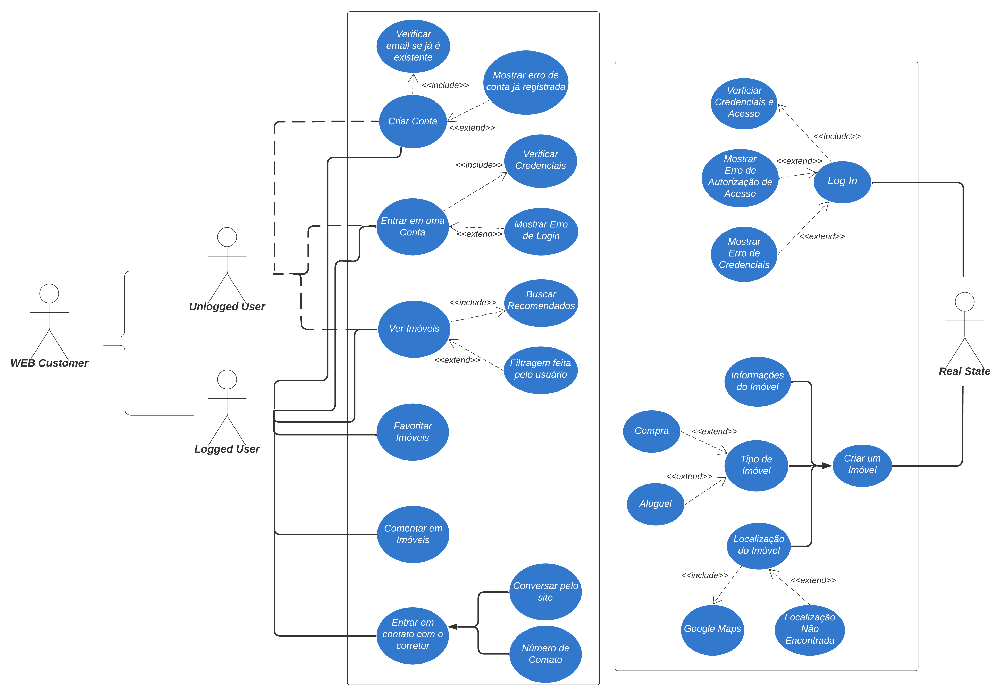
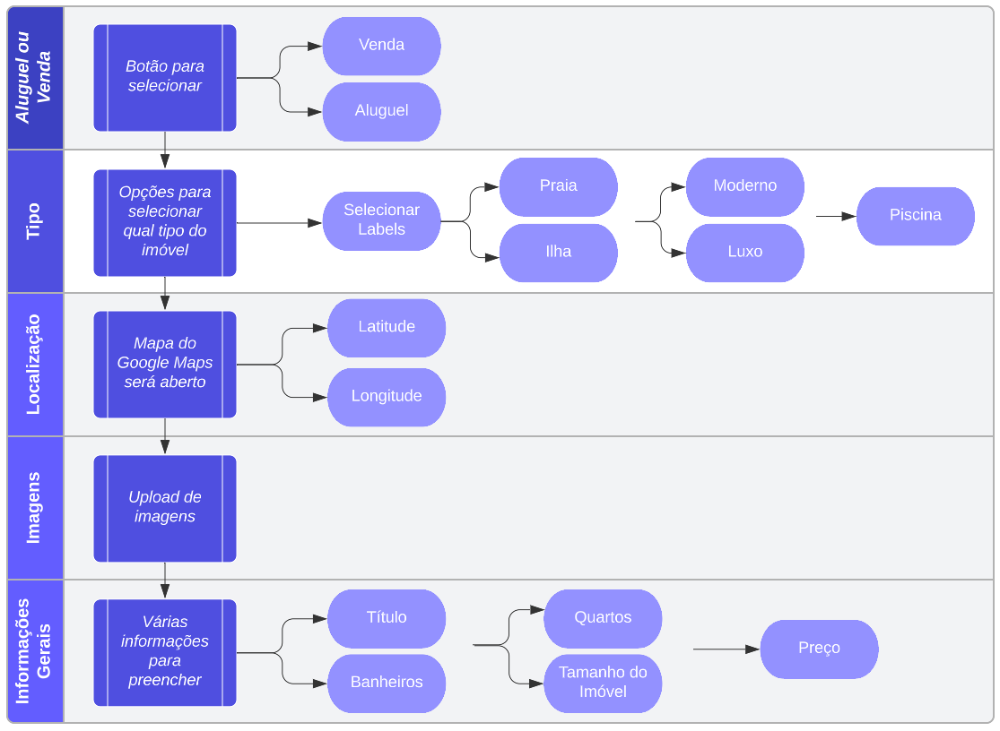

# 
Diagramas

 

# Diagrama UML Use Case
  

## Descrição:
O sistema terá dois endpoints principais. Um em que o usuário, sendo ele logado ou não, interage com a interface e o outro em que o admin, após passar por um cadastro confirmando sua autenticidade, interage com a interface e cria registros dos novos imóveis, edita ou deleta-os.

### Diferença usuário autenticado X usuário não logado
Ambos poderão visualizar todos os imóveis da plataforma e também entrar em contato com a imobiliária, redirecionando o cliente para o Whatsapp. Entretanto, o usuário logado poderá realizar algumas ações dentro dos imóveis, como favoritar e salvar.

 

# Fluxograma para criação de Imóveis
  

## Descrição:
Na rota de admin, os usuários permitidos pelo sistema poderão utilizar a interface para a criação de novos imóveis. Antes disso, aquele deve inserir algumas informações para que seja efetuada corretamente todos os processos de criação. Posteriomente, a maioria dessas informações serão usadas como filtro de busca, ação que poderá efetuada por qualquer um que entre na aplicação. Como mostra o [Diagrama Use Case UML](#diagrama-uml-use-case).

### Imagens
Várias imagens poderão ser importadas pelo usuário autenticado. Para isso, o melhor será armazenar elas por meio de serviços como o [Firebase Storage](https://firebase.google.com/docs/storage?hl=pt-br) para não consumir tanto o processamento de dados.

## Conteúdo escrito do Imóvel
  

Com o auxílio da Inteligência Artificial ChatGPT-3.0, no modelo text-davinci-002 da [OpenAI](https://platform.openai.com), o corretor poderá desenvolver uma mensagem para descrever o imóvel a ser registrado. Após a solicitação para criar um texto característico de imóvel, o ChatGPT irá corrigir, automaticamente, todos os erros gramaticais e de concordância ainda presentes dentro do texto. O corretor poderá socilitar auxílio somente do checador de texto do ChatGPT.

O bot vai retornar uma lista com estabelecimentos próximos - como escolas, hospitais e restaurantes - de onde o corretor marcou no mapa como a localização do imóvel. Quando o cliente visualizar as características do imóvel, além do texto feito pelo corretor, o sistema disponibilizará informações mais precisas acerca dos estabelecimentos próximos ao raio de 500 metros da propriedade - podendo alterar dependendo da localização do imóvel, por exemplo, casas em regiões mais afastadas terá um raio maior a ser considerado, a fim de sempre mostrar qualquer loja próximo ao local em questão.