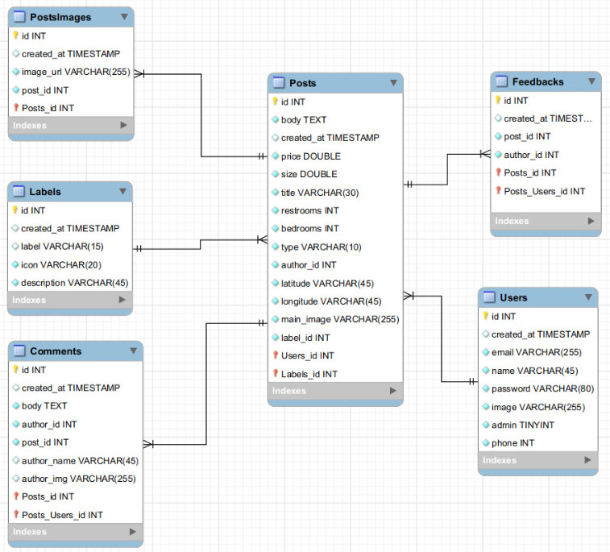

# Schema

## Diagrama EER 

  
   

# Tabela `Users`
## Campos
    Todos os campos, exceto o campo "phone", são obrigatórios

- **id**: Gerado pelo próprio banco de dados.

- **created_at**: Aqui será armazenado a data de inserção. Formato: ANO-MÊS-DIA HORÁRIO

- **email**: Armazena o email do usuário

- **name**: Armazena o nome do usuário, ele não é um identificador único

- **password**: Armazena a senha do usuário, nesse caso, será criptografado com BCrypt para fornecer maior segurança ao usuário

- **image**: O usuário poderá escolher uma foto de perfil e assim personalizá-lo

- **admin**: Esse campo foi feito para fazer verificação caso o usuário seja admin. O campo armazena o tipo Boolean

- **phone**: Aqui será armazenado o celular do admin que será disponibilizado para contato dentro do post de cada imóvel

# Tabela `Posts`
## Campos
    Todos os campos são obrigatórios

- **id**: Gerado pelo próprio banco de dados.

- **body**: Neste campo será armazenado a descrição da propriedade

- **created_at**: Aqui será armazenado a data de inserção. Formato: ANO-MÊS-DIA HORÁRIO

- **price**: Armazena o valor que o usuário quer pelo imóvel, seja para alugar ou para comprar, assim dependendo do campo type, que armazena essa informação

- **size**: O usuário poderá informar o tamanho do imóvel que ele está registrando e será armazenado aqui. A medida é m².

- **title**: Armazena o título do post do imóvel que o usuário decide

- **restrooms**: Armazena a quantidade de banheiros que tem o imóvel, fato que servirá de base para a escolha do cliente.

- **bedrooms**: Armazena a quantidade de quartos que tem o imóvel, fato que servirá de base para a escolha do cliente.

- **type**: Esse campo armazena a informação caso o imóvel for aluguel ou venda e assim influenciar no preço final de anúncio.

- **latitude**: Esse campo armazena a latitude do imóvel da imobiliária

- **longitude**: Esse campo armazena a longitude do imóvel da imobiliária

- **author_id**: Esse campo armazena a o autor que fez o anúncio do imóvel

- **main_image**: Esse campo armazena a imagem principal do anúncio do imóvel

- **label_id**: Esse campo armazena o id do label que ele tem

# Tabela `Feedbacks`
## Campos
    Todos os campos são obrigatórios

- **id**: Gerado pelo próprio banco de dados.

- **created_at**: Aqui será armazenado a data de inserção. Formato: ANO-MÊS-DIA HORÁRIO

- **post_id**: Aqui terá um id que servirá de referência ao post pelo qual o registro Feedback está associado

- **author_id**: Aqui será feito uma conexão entre o autor do Feedback com o seu registro na tabela `Users`

# Tabela `Comments`
## Campos
    Todos os campos são obrigatórios

- **id**: Gerado pelo próprio banco de dados

- **created_at**: Aqui será armazenado a data de inserção. Formato: ANO-MÊS-DIA HORÁRIO

- **body**: Neste campo será armazenado o texto do comentário

- **post_id**: Aqui terá um id que servirá de referência ao post pelo qual o registro Comment está associado

- **author_id**: Aqui será feito uma conexão entre o autor do Comment com o seu registro na tabela `Users`
  
- **author_name**: Este campo armazenará o nome do autor do comentário

- **author_img**: Este camopo armazenará a imagem do autor do comentário

# Tabela `ImagesPosts`
## Propósito
Feito para armazenar diversas imagens pertencentes a um mesmo anúncio de imóvel

## Campos
    Todos os campos são obrigatórios

- **id**: Gerado pelo próprio banco de dados.

- **created_at**: Aqui será armazenado a data de inserção. Formato: ANO-MÊS-DIA HORÁRIO

- **image_url**: Neste campo será armazenado a imagem que o usuário armazenará

- **post_id**: Aqui terá um id que servirá de referência ao post pelo qual o registro Image está associado

# Tabela `Labels`
## Propósito
O objetivo da tabela Labels é dar uma informação extra e um diferencial que o imóvel tenha. Cada post de imóvel poderá conter somente um label, e será selecionado na criação do imóvel, como é mostrado no [Fluxograma]().

## Campos
    Todos os campos são obrigatórios

- **id**: Gerado pelo próprio banco de dados, será referenciado dentro da tabela [Posts](#tabela-posts).

- **created_at**: Aqui será armazenado a data de inserção. Formato: ANO-MÊS-DIA HORÁRIO

- **label**: Nesse campo será armazenado o título do label. Por Exemplo: Casa com piscina

- **icon**: Aqui será armazenado o icon do label, em formato string para posteriormente ser convertido em um icon

- **description**: Essa coluna terá uma breve descrição do que significa o label