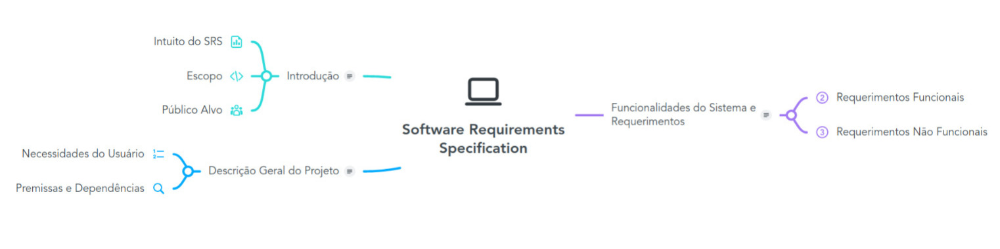
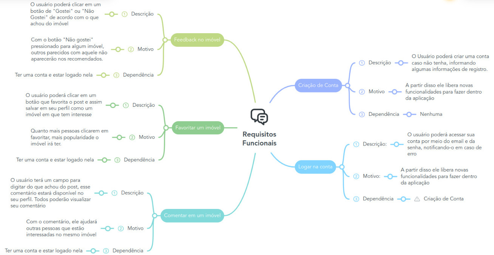
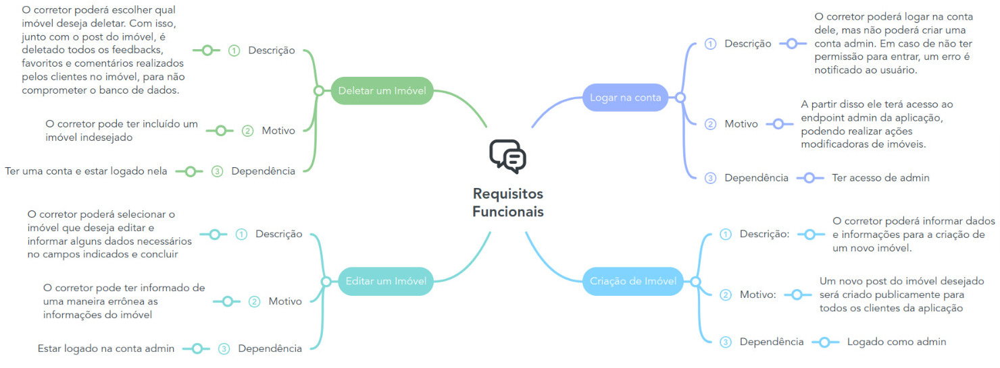

# Software Requirements Specification

 

 

# Índice
## Introdução
- Intuito do SRS
- Escopo
- Público Alvo

## Descrição Geral do Projeto
- Necessidades dos usuário
- Premissas e Dependencias

## Funcionalidades do Sistema e Requisitos
- Requisitos Funcionais
- Requisitos Não Funcionais
  
 

# Introdução

## Intuito do SRS
A documentação foi feita para orientar à todos que queiram usar a aplicação. Nela será resumido os principais requisitos do Software (funcionais e não funcionais). Cada tópico mencionado terá um descrição didática explicando detalhadamente cada parte do projeto. Os principais motivos para a criação desse SRC são:
- Para a realização do design e do brainstorming de novas funcionalidades.
- Planejar duração do projeto

## Escopo
O sistema que será desenvolvido facilitará o uso dos corretores a vender seus imóveis, com uma interface didática, simples e prática. Os clientes poderão filtrar da forma que desejarem a fim de encontrar o imóvel que mais se enquadra às suas necessidades. Além disso, o sistema informará aos clientes os principais atrativos em um raio de 1 kilômetro do imóvel que ele escolheu, possibilitando uma análise mais específica para quem deseja alugar ou comprar o imóvel anunciado.

A princípio, inicialmente, o sistema será voltado para o ambiente WEB. As principais tecnologias que serão empregadas são:

  #### BACKEND
  - **Linguagem**: Java
  - **Framework**: Spring
  - **Banco de dados**: MySQL

  #### FRONTEND
  - **Linguagem**: Javascript & Typescript
  - **Framework**: React & Next

## Público Alvo
O público alvo do meu projeto são os corretores das imobiliárias. Portanto, o produto é destinado a pessoas jurídicas, ou seja, empresas. A definição de consumidor final fará parte da pesquisa do públic-alvo da empresa que estiver utilizando a aplicação

 

# Descrição Geral do Projeto

## Necessidades do usuário
Neste tópico será discutido as principais demandas dos corretores de imóvel, em caso de dúvida, você pode acessar o [UML Use Case](../diagrams/README.md#diagrama-uml-use-case) do projeto. As principais necessidades são:
- Um endpoint separado dos clientes para os corretores. Ambiente onde ele pode criar, editar e deletar de uma maneira fácil e segura os posts dos imóveis.
- Sistema de cadastro para os corretores, que será separada dos clientes.
- Uma vez logado os clientes poderão usufruir de funcionalidade exclusivas, como aponta o [Diagrama](../diagrams/README.md#diagrama-uml-use-case).
- Página completa com todas as informações do imóvel individualmente.
- Interface funcional e simples de uso universal.
- Dar a possibilidade ao cliente de salvar os imóveis que ele mais gostou.
- Deixar vinculado os posts dos imóveis com o telefone do corretor vigente que levará ao whatsapp do mesmo para a realização do contato.
- Notificar os clientes quando um imóvel, que ele tem previamente salvo como favorito, sofrer modificações.
- Fazer um sistema de recomendações para o cliente, baseado nos posts que ele salvou, nas regiões que ele mais procura.
- Sistema de feedbacks individual em cada post de imóvel.

## Premissas e Dependências
Visto que não temos um conhecimento relacionado ao público alvo, precisamos assumir que ele consiga, de qualquer maneira, utilizar a aplicação sem limitações. Assim, a aplicação deve ter:
- Uma interface de simples compreensão e de fácil uso
- O principal objetivo do sistema é conectar da melhor forma e da forma mais objetiva os clientes e os corretores, assim, não será necessário, por exemplo, conectarmos formas de pagamento dentro da aplicação, uma vez que isso será uma alternativa que não convém ao papel do sistema.

 

# Funcionalidades do Sistema e Requerimentos

## Requisitos Funcionais
Existem diversos requerimentos funcionais no projeto. Para melhor organização, irei separar os requisitos de cliente e os requisitos de admin de dentro do projeto.

### Cliente

### Admin / Corretor

## Requisitos Não Funcionais
- Usabilidade: O sistema terá de ser responsivo, ou seja, ter uma interface dinâmica para aparamelhos móveis e para desktops de todos os tamanhos.
- Segurança: Os dados serão guardados com segurança, principalmente os mais sensíveis, por exemplo, a senha, que será criptografada antes mesmo de enviar o pacote para o banco de dados
- Performance: Com poucos cliques o cliente final poderá acessar o imóvel que melhor se enquadra às suas necessidades. Isso só será possível com a filtragem que o usuário poderá efetuar e também com a construção de recomendados de acordo com seus gostos.